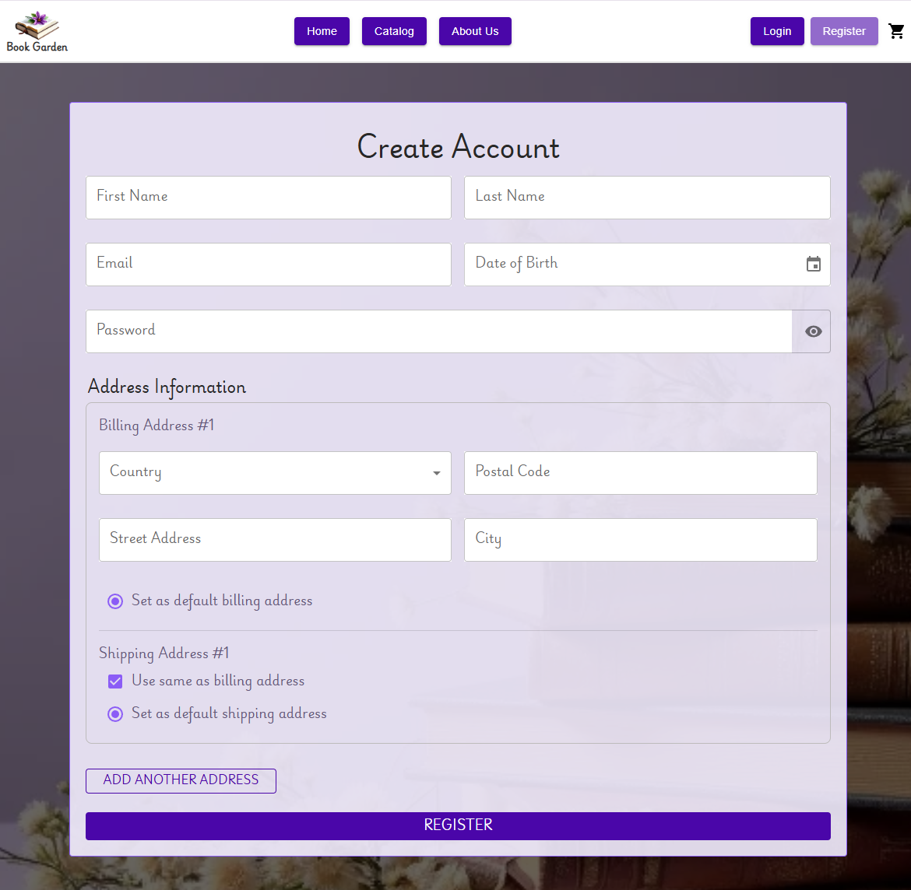
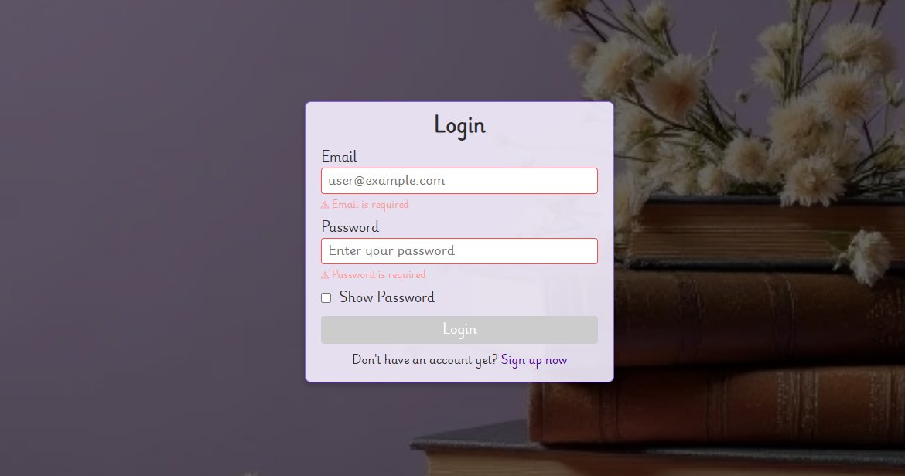

# eCommerce App

**eCommerce App** is a **training frontend project** developed as part of the **RS School eCommerce Application** course.  
The project represents an online store storefront with product catalog, cart, authentication, and user profile features.

> ⚠️ To run the application correctly, a `.env` file with API keys is required.  
> A **trial API access is available for 2 months**.

---

## 📌 Project Origin

> **Important note**

This repository is an **independently maintained personal version** of the original team project:  
https://github.com/KostyaKuk/eCommerce-App

- The original project was developed **in a team**
- After the course completion, the codebase was moved to a **separate personal repository**
- All further improvements and refactoring are done **individually**
- The commit history in this repository **starts from this version**
- Previous team commits and history can be found in the original repository

👉 **Main repository for further development:**  
https://github.com/SquallerQ/eCommerce-App

## 🖥️ Screenshots
  


---

## Features

- Product catalog with categories and search
- Product details page with image slider
- User registration and authentication
- Shopping cart with promo code support
- User profile with personal data management
- Client-side form validation
- Public and protected routes
- Responsive layout

## Technology Stack

- **TypeScript**
- **React**
- **Vite** — module bundler
- **HTML / CSS**
- **ESLint, Prettier** — code quality & formatting
- **Jest** — testing
- **Husky** — pre-commit hooks


## 🔐 Environment Variables

To run the project locally, create a `.env` file in the project root.

Example:
```env
# Commercetools API configuration (example)

VITE_CTP_PROJECT_KEY=your-project-key
VITE_CTP_CLIENT_SECRET=your-client-secret
VITE_CTP_CLIENT_ID=your-client-id

VITE_CTP_AUTH_URL=https://auth.europe-west1.gcp.commercetools.com
VITE_CTP_API_URL=https://api.europe-west1.gcp.commercetools.com

VITE_CTP_SCOPES=manage_project:your-project-key
```

## 📦 Run Application Locally
1. **Clone the repository**
   ```bash
   git clone https://github.com/SquallerQ/eCommerce-App.git
   cd eCommerce-App
   ```

2. **Install dependencies**
   ```bash
   npm install
   ```

3. **Create .env file**
(see Environment Variables section)

4. **Start development server:**
   ```bash
   npm run dev
   ```
✅ The application will be available at
http://localhost:5173

